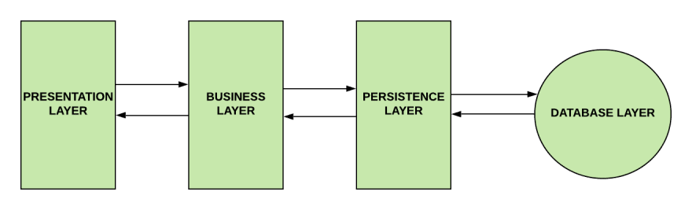
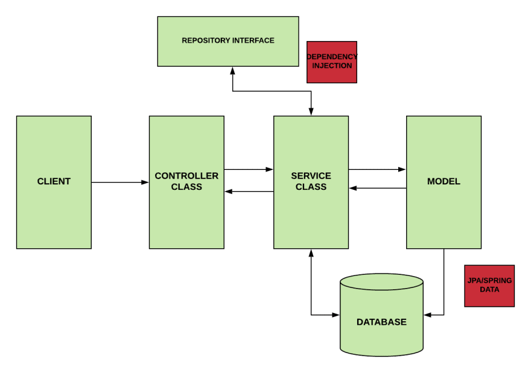

# Spring Boot

## Spring
The Spring Framework (Spring) is an open-source application framework that provides infrastructure support for 
developing Java applications.

One of the most popular Java Enterprise Edition (Java EE) frameworks, Spring helps developers create high performing 
applications using Plain Old Java Objects (POJOs).

### Disadvantage of Spring
1. Complexity: Working with Spring is more complex. It requires a lot of expertise. If you have not used Spring before, 
first you will have to learn. The learning curve is also difficult, so if you have not a lot of development experience, 
it is difficult to learn. The main disadvantage of spring projects is that configuration is really time-consuming and 
can be a bit overwhelming for the new developers.

2. Parallel Mechanism: It provides multiple options to developers. These options create confusion to developers that 
which feature to use and which to not and wrong decisions may lead to significant delays.

3. No Specific Guidelines: It does not care about XSS or cross-site scripting. With this in mind, we need to figure out 
ways on how to stop hackers from infiltrating your application yourself.

4. High Learning Curve: If you have no development experience in the field, it would be quite difficult to learn It is 
difficult due to new programming methods.

5. Lots of XML: Developing a Spring application requires lots of XML.

## Spring Boot
- Spring Boot is built on the top of the spring and contains all the features of spring.
- Spring Boot is a microservice-based framework and making a production-ready application in it takes very less time.

#### Micro Service
It is an architecture that allows the developers to develop and deploy services independently. Each service running has 
its own process and this achieves the lightweight model to support business applications.

##### Advantages
Microservices offer the following advantages to its developers −
- Easy deployment
- Simple scalability
- Compatible with Containers
- Minimum configuration
- Lesser production time

### Advantages of Spring Boot
Spring Boot offers the following advantages to its developers −

- Easy to understand and develop spring applications
- Increases productivity
- Reduces the development time

### Goals
Spring Boot is designed with the following goals −

- To avoid complex XML configuration in Spring
- To develop a production ready Spring applications in an easier way
- To reduce the development time and run the application independently
- Offer an easier way of getting started with the application

### Why Spring Boot?
You can choose Spring Boot because of the features and benefits it offers as given here −

1. It provides a flexible way to configure Java Beans, XML configurations, and Database Transactions.
2. It provides a powerful batch processing and manages REST endpoints.
3. In Spring Boot, everything is auto-configured; no manual configurations are needed.
4. It offers annotation-based spring application
5. Eases dependency management
6. It includes Embedded Servlet Container

### Limitation
Spring Boot can use dependencies that are not going to be used in the application. These dependencies increase the size 
of the application.

### Difference between Spring and Spring Boot

| No. | Spring                                                                                         | Spring Boot                                                                                         |
|-----|------------------------------------------------------------------------------------------------|-----------------------------------------------------------------------------------------------------|
| 1   | Spring is an open-source lightweight framework widely used to develop enterprise applications. | Spring Boot is built on top of the conventional spring framework, widely used to develop REST APIs. |
| 2   | The most important feature of the Spring Framework is dependency injection.                    | The most important feature of the Spring Boot is Autoconfiguration.                                 |
| 3   | It helps to create a loosely coupled application.                                              | It helps to create a stand-alone application.                                                       |
| 4   | To run the Spring application, we need to set the server explicitly.                           | Spring Boot provides embedded servers such as Tomcat and Jetty etc.                                 |
| 5   | To run the Spring application, a deployment descriptor is required.                            | There is no requirement for a deployment descriptor.                                                |
| 6   | To create a Spring application, the developers write lots of code.                             | It reduces the lines of code.                                                                       |
| 7   | It doesn’t provide support for the in-memory database.                                         | It provides support for the in-memory database such as H2.                                          |

### Architecture
Spring Boot Architecture has four layers:

1. Presentation Layer
2. Business Layer
3. Persistence Layer
4. Database Layer

#### Presentation Layout

This layer is at the top of the architecture. This tier is responsible for:

- Performing authentication.
- Converting JSON data into an object (and vice versa).
- Handling HTTP requests.
- Transfering authentication to the business layer.

The presentation layer is the equivalent of the Controller class. The Controller class handles all the incoming REST API 
requests (GET, POST, PUT, DELETE, PATCH) from the Client.

#### Business Layer

The business layer is responsible for:

- Performing validation. 
- Performing authorization. 
- Handling the business logic and rules.

This layer is the equivalent to the Service class. It's where we handle the business logic.

The Business layer communicates with both the Presentation layer and the Persistence Layer.

#### Persistence Layer

This layer is responsible for:

- Containing storage logic.
- Fetching objects and translating them into database rows (and vice versa).

This layer is the equivalent of the Repository interface. We write database queries inside this interface.

The Persistence layer is the only layer that communicates with the Business layer and the Database layer.

#### Database Layer

This layer is responsible for:

- Performing database operations (mainly CRUD operations).

> In computer programming, create, read, update, and delete (CRUD) are the four basic functions of persistent storage.

This layer is simply the actual database that you decide to use to build your application.

### WorkFlow

Spring Boot workflow acts like this:

1. The Client makes an HTTP request.
2. The Controller class receives the HTTP request.
3. The Controller understands what type of request will process, and then it deals with it.
4. If it is needed, it calls the service class.
5. The Service Class is going to handle the business logic. It does this on the data from the database.
6. If everything goes well, we return a JSP page.

